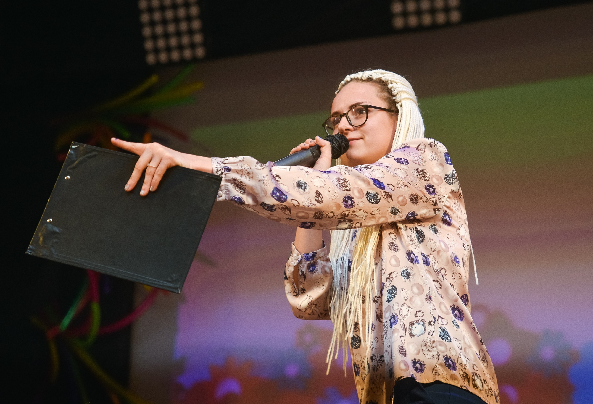

## Форостовская Ирина Игоревна

Возраст: 26 лет 

**Навыки и умения:**

_Художественные навыки:_ режиссура, актёрское мастерство, сценическое движение, сценическая речь.

Подготовка праздничных сценариев, концертных программ, спектаклей и участие в них, определение готовности и принятие решения об их публичном исполнении. Организация работы артистического и художественного персонала. 
Ведение отдельных направлений творческой деятельности.
Формирование имиджа компании, создание афиш, баннеров, поддер-жание сайта и страниц в социальных сетях.
Поддержание художественного качества репертуара.
Привлечение спонсоров для реализации проектов.
Взаимодействие с контролирующими организациями.
Контроль проведения спектакль.
Работа с режиссером.
Подготовка выпуска спектакля.
Взаимодействие с цехами, работающими над созданием и поддержа-нием спектаклей.

